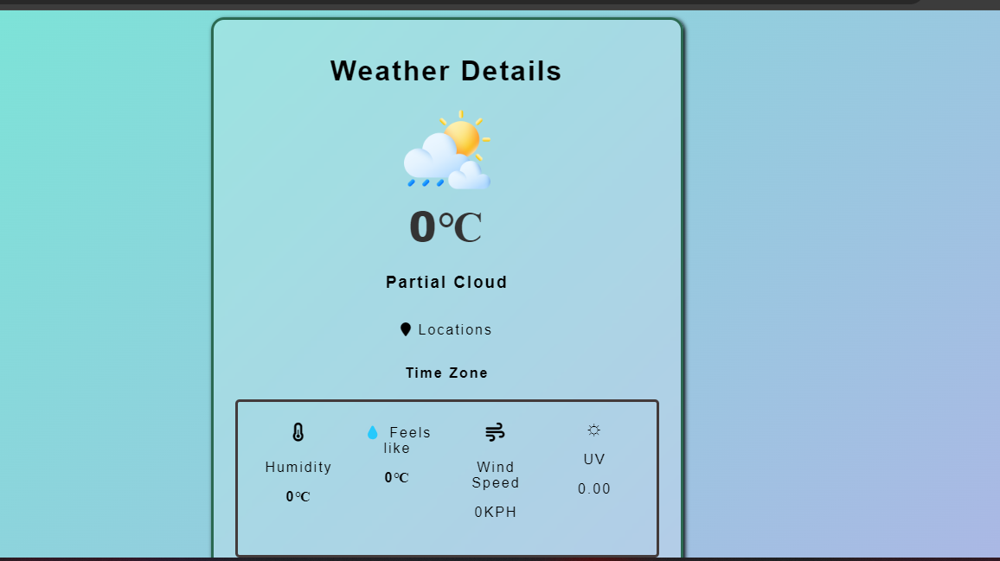

# 🌦️ Weather App

A simple and responsive **Weather Application** built using **HTML, CSS, and JavaScript**.
The app fetches real-time weather data using the WeatherAPI and displays information such as temperature, humidity, wind speed, UV index, and weather conditions for any city.

---

## 🚀 Features

* 🌍 Search weather by **city name**
* 🌡️ Shows **current temperature**
* ☁️ Displays **weather condition and icon**
* 💧 Shows **humidity**
* 🌬️ Shows **wind speed**
* ☀️ Shows **UV index**
* 📍 Displays **location and region**
* 🎨 **Dynamic background** based on weather conditions
* 📱 **Mobile responsive design**

---

## 🛠️ Technologies Used

* **HTML5** – Structure of the application
* **CSS3** – Styling and responsive design
* **JavaScript (ES6)** – API calls and dynamic UI updates
* **Font Awesome** – Icons
* **WeatherAPI** – Real-time weather data

---

## 📡 API Used

Weather data is fetched from:

https://www.weatherapi.com/

Example API Endpoint:

https://api.weatherapi.com/v1/current.json?key=YOUR_API_KEY&q=CITY_NAME

---

## 📂 Project Structure

```
weather-app
│
├── index.html
├── style.css
├── app.js
└── README.md
```

---

## ⚙️ How to Run the Project

1. Clone the repository

```
git clone https://github.com/yourusername/weather-app.git
```

2. Open the project folder

3. Replace the API key in `app.js`

```
const APIKEY = "YOUR_API_KEY";
```

4. Open **index.html** in your browser.

---

## 📱 Responsive Design

The app is optimized for:

* Desktop 💻
* Tablet 📱
* Mobile Devices 📲

---

## 💡 Future Improvements

* Add **loading spinner while fetching data**
* Show **5-day weather forecast**
* Add **auto location detection**
* Add **weather animations**
* Store **recent search history**

---

## 📸 Preview

Add screenshots of your app here.



## 👨‍💻 Author

Sunny Kumar

---

⭐ If you like this project, consider giving it a **star on GitHub**.
